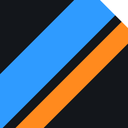
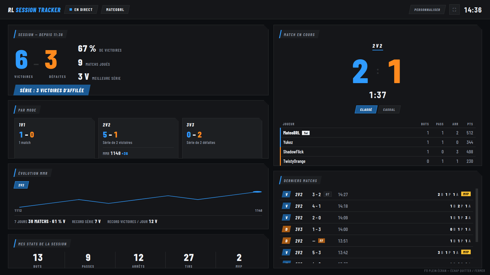
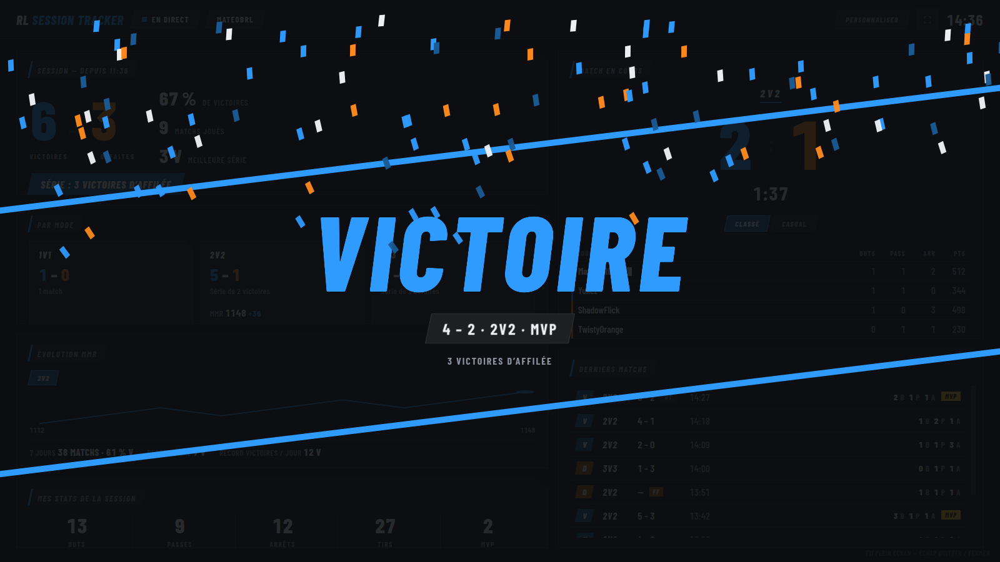
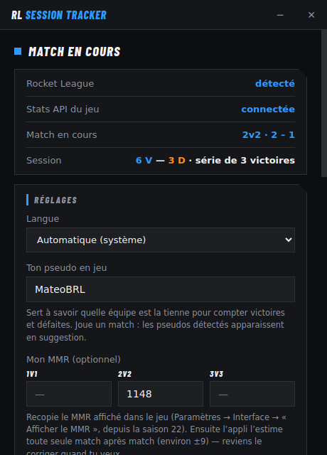
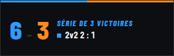
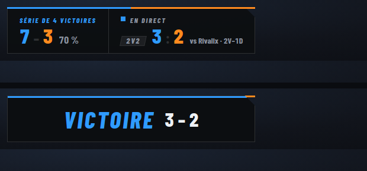

<div align="center">



# RL Session Tracker

**BakkesMod est banni. Pas tes stats.**
**BakkesMod is banned. Your stats aren't.**

Le tracker de session Rocket League nouvelle génération — temps réel, 100 % local, compatible anti-triche.
The next-generation Rocket League session tracker — real-time, 100% local, anti-cheat safe.

[](https://github.com/mateo-brl/rl-session-tracker/releases/latest)
[](https://github.com/mateo-brl/rl-session-tracker/actions)
[](LICENSE)


**[⬇️ Télécharger / Download](https://github.com/mateo-brl/rl-session-tracker/releases/latest) · [🇫🇷 Français](#-français) · [🇬🇧 English](#-english)**

<br/>



</div>

---

## 🇫🇷 Français

> **Avril 2026.** L'anti-triche de Rocket League débarque et emporte BakkesMod
> avec lui. Plus d'overlays, plus de trackers de session.
>
> **Sauf que.** Le jeu expose désormais une **Stats API native** — un flux
> local, officiel, compatible anti-triche. RL Session Tracker s'en sert pour
> tout reconstruire, en mieux : un vrai dashboard de session sur ton 2ᵉ écran,
> qui s'ouvre tout seul quand tu lances le jeu, et qui n'envoie **rien** sur
> internet.

Victoires · défaites · série · stats par mode · MMR · bilan contre tes rivaux
— détectés à la seconde, directement depuis le jeu. Aucune inscription, aucun
site externe, aucun risque de ban.

⭐ **L'app te sert ? Une étoile sur le dépôt aide d'autres joueurs à la
trouver — et c'est le seul « merci » qu'elle demandera jamais.**

### 📸 Aperçu



<p align="center">
  
  &nbsp;&nbsp;
  
</p>

<p align="center">
  <br/>
  <i>Mode streamer : l'overlay OBS en 3 styles — Broadcast, Compact, Vertical — et sa bannière de fin de match. Style, taille, fond et contenu se règlent depuis l'application, appliqués en direct dans OBS.</i>
</p>

### ✨ Ce que ça fait

| | |
|---|---|
| 🖥️ **Dashboard auto** | Tu lances Rocket League → le tracker s'ouvre en plein écran sur ton 2ᵉ écran. Tu quittes le jeu → il se ferme. |
| ⚡ **Temps réel** | Score, temps, overtime, stats des joueurs — à la seconde, pendant le match. |
| 📊 **Ta session** | Victoires/défaites, % de victoires, série en cours, meilleure série, par mode (1v1 · 2v2 · 3v3). La liste des matchs récents repart à zéro à chaque lancement (ou d'un clic). |
| 📈 **Évolution MMR** | Recopie une fois ton MMR affiché en jeu (saison 22+) : courbe d'évolution match après match, bilan des 7 derniers jours, records de tous les temps. |
| 🤝 **Déjà croisé** | Un adversaire que tu as déjà affronté ? Ton bilan contre lui (2V – 1D) s'affiche à côté de son nom pendant le match — savoureux en 1v1. |
| ⚖️ **Comptage honnête** | Un forfait adverse compte comme une victoire, quitter un match classé comme une défaite (comme dans le jeu). Un commutateur Classé/Casual sur chaque match en direct évite que le casual pollue ton MMR. |
| ✏️ **Corrige un résultat** | Un forfait adverse mal interprété ? Corrige n'importe quel match de l'historique du dashboard en un clic (victoire ↔ défaite) : stats et courbe MMR se recalculent aussitôt, rétroactivement. |
| 🥅 **Tes stats** | Buts, passes, arrêts, tirs, MVP — cumulés sur la session et détaillés match par match. |
| 🪄 **Zéro config** | Pas de compte, pas de code. L'appli détecte même ton pseudo toute seule après 2-3 matchs. |
| 🎯 **Mini-overlay** | Petit bandeau toujours au premier plan (W–L, série, score live) pour jouer sur un seul écran. |
| 🎮 **Statut Discord** | Rich Presence optionnelle : tes amis voient « Classé 2v2 · 3 – 2 » et ta série en cours, en direct. |
| 🔌 **Compatible overlays SOS** | Un pont optionnel réémet le flux du jeu sur `ws://127.0.0.1:49122` au format de l'ancien plugin SOS, muet en ligne depuis Easy Anti-Cheat. Les overlays de diffusion écrits avant avril 2026 refonctionnent tels quels, sans rien modifier chez eux. |
| 📺 **Mode streamer (OBS)** | Un overlay de stream servi en local (`http://127.0.0.1:49350/overlay`) à capturer en source Navigateur — **100 % personnalisable** : 3 styles (Broadcast, Compact, Vertical), taille, opacité du fond, chaque élément activable (série, score live, déjà croisé, flash de but, bannière), réglé depuis l'app et appliqué en direct dans OBS. Aux couleurs de ton thème, fond transparent. |
| 🔄 **Mises à jour auto** | Une nouvelle version sort → un bouton « Mettre à jour » apparaît → un clic et c'est fait. |
| 🔊 **Jingles** | Un son de victoire, un son de défaite (désactivables) — et un tiltomètre après 3 défaites d'affilée. |
| 🎨 **Personnalisable** | Chaque bloc du dashboard se déplace, se redimensionne et se masque — avec 3 profils de disposition et des widgets bonus (horloge, objectif de MMR). 8 thèmes de couleurs prédéfinis (ou totalement libres), 5 styles d'animations et 4 jingles testables en un clic, overlay réglable. |
| 🌍 **FR / EN** | Interface bilingue : langue du système détectée automatiquement, modifiable dans les réglages. |

### 🆚 Pourquoi celui-là ?

| | RL Session Tracker | Sites de tracking | Mods d'avant (BakkesMod…) |
|---|:---:|:---:|:---:|
| Temps réel pendant le match | ✅ | ❌ (après coup) | ✅ |
| Compatible anti-triche (EAC) | ✅ | ✅ | ❌ banni en ligne |
| 100 % local, zéro compte | ✅ | ❌ | ✅ |
| Dashboard 2ᵉ écran automatique | ✅ | ❌ | ❌ |
| Risque pour ton compte | **Aucun** | Aucun | Réel |

### 🚀 Installation (2 minutes, aucune connaissance requise)

1. **Télécharge** le fichier `RL-Session-Tracker-Setup-X.Y.Z.exe` depuis la
   [dernière release](https://github.com/mateo-brl/rl-session-tracker/releases/latest).
2. **Double-clique** dessus. Si Windows affiche « Éditeur inconnu », clique
   *Informations complémentaires* → *Exécuter quand même* (l'application
   n'est pas signée, c'est normal pour un projet gratuit).
3. Au premier lancement, **clique « Oui »** à la fenêtre d'autorisation
   Windows : elle active la Stats API du jeu (un fichier de configuration de
   Rocket League).
4. **Lance Rocket League et joue.** C'est tout. 🎉

L'application :
- s'installe en **démarrage automatique** avec Windows (elle vit discrètement
  dans la zone de notification — **Ctrl+Alt+R** fait apparaître le panneau de
  configuration de n'importe où, jeu compris, et un réglage permet de le
  garder plutôt dans la barre des tâches) ;
- **détecte ton pseudo toute seule** après quelques matchs (c'est le seul
  joueur présent dans toutes tes parties) ;
- ouvre le **dashboard sur ton 2ᵉ écran** dès que le jeu démarre.

> 💡 **Optionnel — le MMR :** active « Afficher le MMR » dans les paramètres
> de Rocket League (Interface), recopie les valeurs dans la fenêtre de
> l'application, et le dashboard suivra ton MMR estimé (≈ ±9 par match
> classé). Tu peux le corriger quand tu veux.
>
> ⚠️ **Matchs de placement** (début de saison) : les gains y sont bien plus
> gros (souvent ±15 et dégressifs), l'estimation dérive forcément pendant
> cette période. Recopie ton MMR en jeu une fois tes placements terminés —
> l'application te signale d'ailleurs les gros écarts quand tu recalibres.

#### ❓ Petits soucis courants

<details>
<summary><b>Le dashboard ne montre rien pendant mes matchs</b></summary>

La Stats API du jeu n'est probablement pas active. Ouvre la fenêtre de
l'application (icône dans la barre des tâches) → clique **« Réactiver la
Stats API du jeu »** → accepte la fenêtre Windows → **redémarre Rocket
League**. En dernier recours, double-clique sur `enable-statsapi.bat`
(inclus dans ce dépôt).
</details>

<details>
<summary><b>Mes victoires/défaites ne sont pas comptées</b></summary>

L'application ne sait pas encore qui tu es. Joue 2-3 matchs (elle détecte ton
pseudo automatiquement), ou ouvre la fenêtre de l'application et choisis ton
pseudo dans les suggestions.
</details>

<details>
<summary><b>Le mini-overlay n'apparaît pas par-dessus le jeu</b></summary>

Rocket League est en mode « Plein écran » exclusif : Windows ne laisse alors
**aucune** fenêtre passer devant le jeu (c'est pareil pour tous les overlays).
Mets l'affichage en **« Fenêtré sans bordure »** (Paramètres → Vidéo) —
visuellement identique, et l'overlay passera devant.
</details>

<details>
<summary><b>Le dashboard s'ouvre sur le mauvais écran</b></summary>

Il choisit l'écran **secondaire** automatiquement. Si tu préfères le placer
toi-même, décoche « plein écran » dans les réglages : il s'ouvrira en fenêtre
normale que tu peux déplacer.
</details>

<details>
<summary><b>Je suis sur Steam, ça marche ?</b></summary>

Oui, exactement pareil que sur Epic : l'application détecte les deux
installations automatiquement (manifestes Epic, registre Steam et toutes tes
bibliothèques Steam, même sur un autre disque). Un point à connaître : après
une **« Vérification de l'intégrité des fichiers »** dans Steam ou une grosse
mise à jour du jeu, le fichier de la Stats API peut être réinitialisé.
L'application le vérifie désormais **à chaque lancement** et le réactive
toute seule (une fenêtre admin à accepter). Si ça arrive en pleine session,
reclique **« Réactiver la Stats API du jeu »** et redémarre Rocket League.
(Pareil pour la réparation Epic.)
</details>

> ⚠️ La Stats API n'existe que sur **PC** (Epic / Steam). L'application est
> Windows uniquement.

### 🧩 Comment ça marche

```
 ┌──────────────────────────── ton PC ────────────────────────────┐
 │                                                                │
 │  🎮 Rocket League ──Stats API──►  🛰️ RL Session Tracker        │
 │     (socket local 49123)            │   barre des tâches       │
 │                                     ├─► 🖥️ dashboard 2ᵉ écran  │
 │                                     └─► 💾 matchs (en local)   │
 │                                                                │
 └────────────────────────────────────────────────────────────────┘
                          ▲
            GitHub Releases (mises à jour auto)
```

Tout est local : tes matchs sont enregistrés dans un fichier JSON sur ton PC
(`%APPDATA%/RL Session Tracker`), rien n'est envoyé nulle part. La seule
connexion sortante est la vérification de mise à jour sur GitHub.

**D'où vient le MMR ?** La Stats API du jeu ne le diffuse pas, les sites
comme tracker.gg n'ont pas d'API publique (et leur scraping casse sans
arrêt), et les API tierces exigent des clés privées. Mais le jeu écrit
lui-même son MMR **en clair**, dans son journal
(`Documents\My Games\Rocket League\TAGame\Logs\Launch.log`), à chaque mise
en file classée. L'application le relit et recale automatiquement ta courbe
dessus : entre deux files, elle continue d'estimer à ±9 par match, mais
l'écart repart de zéro à chaque partie lancée au lieu de s'accumuler. Mieux :
elle compare aussi la variation réelle du MMR au bilan des matchs enregistrés
sur la période — si un forfait mal classé explique l'écart, elle corrige le
résultat automatiquement.

C'est une simple lecture de fichier, en dehors du processus du jeu — aucune
injection, aucune lecture mémoire, rien qui puisse déplaire à l'anti-triche.
Deux limites assumées : rien n'est écrit quand tu n'es pas chef de groupe, et
le dernier match d'une session n'est pris en compte qu'à ta prochaine mise en
file. Le format n'étant pas documenté par Psyonix, il peut changer à un patch :
dans ce cas l'application ne casse pas, elle revient simplement à l'estimation
seule. Tu peux aussi tout désactiver et saisir ton MMR à la main, comme avant.

### 🧰 Pour les développeurs

| Côté | Technologies |
|---|---|
| **Application** | Electron — un seul processus principal, fenêtres HTML/CSS/JS sans framework ni étape de build |
| **Données** | Stats API native du jeu (socket TCP `127.0.0.1:49123`, JSON concaténé) |
| **Empaquetage** | electron-builder — installeur NSIS un-clic |
| **Mises à jour** | electron-updater + GitHub Releases (`latest.yml`) |
| **Qualité** | Tests unitaires et d'intégration (`node --test`), CI à chaque push |

```bash
git clone https://github.com/mateo-brl/rl-session-tracker.git
cd rl-session-tracker
npm install
npm start          # lance l'application en mode développement
node --test        # lance les tests
npm run dist       # construit l'installeur Windows dans dist/
```

#### Publier une nouvelle version

```bash
npm version minor          # bump package.json + tag vX.Y.Z
git push --follow-tags
```

Le workflow GitHub Actions ([release.yml](.github/workflows/release.yml))
construit l'installeur sur Windows et publie la release (déclenchable aussi
par un commit `main` contenant `[release]`, ou à la main depuis l'onglet
Actions). Toutes les applications installées la verront et proposeront le
bouton « Mettre à jour ».

<details>
<summary>🗂️ Structure du projet</summary>

```
rl-session-tracker/
├── src/
│   ├── main/                  # Processus principal Electron
│   │   ├── index.js           # Cycle de vie, tray, IPC, câblage général
│   │   ├── statsapi.js        # Connecteur Stats API (TCP, parseur de flux)
│   │   ├── game-watcher.js    # Détection du processus RocketLeague.exe
│   │   ├── session.js         # Journal des matchs + stats + MMR + records
│   │   ├── config.js          # Préférences (pseudo, MMR, options)
│   │   ├── windows.js         # Fenêtres : contrôle, dashboard, overlay
│   │   ├── updater.js         # Mises à jour automatiques (GitHub Releases)
│   │   ├── discord-rpc.js     # Statut Discord (pipe IPC local, sans dépendance)
│   │   ├── obs-server.js      # Mode streamer : overlay OBS servi en local (SSE)
│   │   ├── sos-bridge.js      # Pont WebSocket compatible plugin SOS (49122)
│   │   ├── rl-log.js          # Vrai MMR + playlist lus dans Launch.log
│   │   └── enable-statsapi.js # Active la Stats API du jeu (PowerShell élevé)
│   ├── preload.js             # Pont IPC sécurisé (contextIsolation)
│   └── renderer/
│       ├── control.html       # Fenêtre de contrôle / réglages
│       ├── dashboard.html     # Le tracker plein écran
│       ├── overlay.html       # Mini-overlay toujours au premier plan
│       ├── obs.html           # Overlay de stream (capturé dans OBS)
│       └── fonts/             # Barlow Condensed (licence OFL-1.1)
├── build/icon.ico             # Icône de l'application
├── electron-builder.yml       # Empaquetage NSIS + publication GitHub
├── .github/workflows/         # CI (tests) + release (build Windows)
└── enable-statsapi.bat / .ps1 # Activation manuelle de secours
```
</details>

### 📄 Licence

MIT — fais-en ce que tu veux. La police Barlow Condensed est sous licence
OFL-1.1.

<div align="center">

**Si ce projet t'a été utile, [laisse une étoile ⭐](https://github.com/mateo-brl/rl-session-tracker/stargazers) — ça prend deux secondes et ça aide énormément.**

</div>

---

## 🇬🇧 English

> **April 2026.** Rocket League's anti-cheat arrives and takes BakkesMod down
> with it. No more overlays, no more session trackers.
>
> **Except.** The game now exposes a **native Stats API** — a local, official,
> anti-cheat-friendly feed. RL Session Tracker uses it to rebuild everything,
> better: a real session dashboard on your second screen that opens by itself
> when you launch the game, and sends **nothing** to the internet.

Wins · losses · streak · per-mode stats · MMR · record against your rivals —
detected the second they happen, straight from the game. No sign-up, no
third-party website, no ban risk.

⭐ **Found it useful? A star on the repo helps other players discover it —
and it's the only "thank you" this app will ever ask for.**

### 📸 Preview


<p align="center">
  
  &nbsp;&nbsp;
  
</p>

<p align="center">
  <br/>
  <i>Streamer mode: the OBS overlay in 3 styles — Broadcast, Compact, Vertical — and its end-of-match banner. Style, size, background and content are set from the app and applied live in OBS.</i>
</p>

### ✨ Features

| | |
|---|---|
| 🖥️ **Auto dashboard** | Launch Rocket League → the tracker opens fullscreen on your second screen. Quit the game → it closes. |
| ⚡ **Real time** | Score, clock, overtime, player stats — to the second, during the match. |
| 📊 **Your session** | Wins/losses, win rate, current streak, best streak, per mode (1v1 · 2v2 · 3v3). The recent-matches list starts fresh on every launch (or with one click). |
| 📈 **MMR tracking** | Copy your in-game MMR once (Season 22+): match-by-match evolution chart, last-7-days summary, all-time records. |
| 🤝 **Seen before** | Facing an opponent you've already played? Your record against them (2W – 1L) shows next to their name during the match — delicious in 1v1. |
| ⚖️ **Honest counting** | An opponent forfeit counts as a win, leaving a ranked match as a loss (just like in the game). A Ranked/Casual switch on each live match keeps casual games from polluting your MMR. |
| ✏️ **Fix a result** | Misjudged an opponent forfeit? Fix any match in the dashboard history in one click (win ↔ loss) — stats and the MMR chart recalculate instantly, retroactively. |
| 🥅 **Your stats** | Goals, assists, saves, shots, MVP — session totals and per-match detail. |
| 🪄 **Zero config** | No account, no code. The app even detects your in-game name by itself after 2-3 matches. |
| 🎯 **Mini-overlay** | Small always-on-top strip (W–L, streak, live score) for single-screen setups. |
| 🎮 **Discord status** | Optional Rich Presence: your friends see "Ranked 2v2 · 3 – 2" and your current streak, live. |
| 🔌 **SOS overlay bridge** | An optional bridge rebroadcasts the game feed on `ws://127.0.0.1:49122` in the format of the old SOS plugin, silent online since Easy Anti-Cheat. Broadcast overlays written before April 2026 work again as-is, with no changes on their side. |
| 📺 **Streamer mode (OBS)** | A locally served stream overlay (`http://127.0.0.1:49350/overlay`) to capture as a Browser source — **fully customizable**: 3 styles (Broadcast, Compact, Vertical), size, background opacity, every element toggleable (streak, live score, seen-before, goal flash, banner), set from the app and applied live in OBS. In your theme colors, transparent background. |
| 🔄 **Auto updates** | A new version ships → an "Update" button appears → one click and you're done. |
| 🔊 **Jingles** | A win sound, a loss sound (can be turned off) — and a tilt-o-meter after 3 losses in a row. |
| 🎨 **Customizable** | Every dashboard block can be moved, resized and hidden — with 3 layout profiles and bonus widgets (clock, MMR goal). 8 built-in color themes (or fully custom), 5 animation styles and 4 jingles testable in one click, adjustable overlay. |
| 🌍 **FR / EN** | Bilingual interface: system language auto-detected, changeable in the settings. |

### 🆚 Why this one?

| | RL Session Tracker | Tracking websites | Old-school mods (BakkesMod…) |
|---|:---:|:---:|:---:|
| Real-time during the match | ✅ | ❌ (after the fact) | ✅ |
| Anti-cheat (EAC) compatible | ✅ | ✅ | ❌ banned online |
| 100% local, no account | ✅ | ❌ | ✅ |
| Automatic second-screen dashboard | ✅ | ❌ | ❌ |
| Risk for your account | **None** | None | Real |

### 🚀 Install (2 minutes, no technical knowledge needed)

1. **Download** `RL-Session-Tracker-Setup-X.Y.Z.exe` from the
   [latest release](https://github.com/mateo-brl/rl-session-tracker/releases/latest).
2. **Double-click** it. If Windows shows "Unknown publisher", click
   *More info* → *Run anyway* (the app isn't code-signed, which is normal
   for a free project).
3. On first launch, **click "Yes"** on the Windows permission prompt: it
   enables the game's Stats API (a Rocket League config file).
4. **Launch Rocket League and play.** That's it. 🎉

The app:
- installs itself to **start with Windows** (it lives quietly in the
  notification area — **Ctrl+Alt+R** brings up the settings panel from
  anywhere, in-game included, and a setting keeps it in the taskbar
  instead);
- **detects your in-game name by itself** after a few matches (you're the
  only player present in all of them);
- opens the **dashboard on your second screen** as soon as the game starts.

> 💡 **Optional — MMR:** enable "Show MMR" in Rocket League's settings
> (Interface), copy the values into the app window, and the dashboard will
> track your estimated MMR (≈ ±9 per ranked match). You can correct it
> anytime.
>
> ⚠️ **Placement matches** (start of season): gains are much bigger there
> (often ±15 and decreasing), so the estimate inevitably drifts during that
> period. Copy your in-game MMR again once placements are done — the app
> also flags big gaps when you recalibrate.

#### ❓ Troubleshooting

<details>
<summary><b>The dashboard shows nothing during my matches</b></summary>

The game's Stats API is probably not enabled. Open the app window (tray
icon) → click **"Re-enable the game's Stats API"** → accept the Windows
prompt → **restart Rocket League**. As a last resort, double-click
`enable-statsapi.bat` (included in this repo).
</details>

<details>
<summary><b>My wins/losses aren't counted</b></summary>

The app doesn't know who you are yet. Play 2-3 matches (it detects your name
automatically), or open the app window and pick your name from the
suggestions.
</details>

<details>
<summary><b>The mini-overlay doesn't show above the game</b></summary>

Rocket League is in exclusive "Fullscreen" mode: Windows then lets **no**
window appear above the game (the same goes for every overlay). Set the
display mode to **"Borderless Windowed"** (Settings → Video) — visually
identical, and the overlay will show on top.
</details>

<details>
<summary><b>The dashboard opens on the wrong screen</b></summary>

It picks the **secondary** display automatically. If you'd rather place it
yourself, untick "fullscreen" in the settings: it opens as a normal window
you can move around.
</details>

<details>
<summary><b>I'm on Steam, does it work?</b></summary>

Yes, exactly like on Epic: the app detects both installs automatically (Epic
manifests, the Steam registry and all your Steam libraries, even on another
drive). One thing to know: after a **"Verify integrity of game files"** in
Steam or a big game update, the Stats API config file can be reset. The app
now checks this **on every launch** and re-enables it by itself (one admin
prompt to accept). If it happens mid-session, click **"Re-enable the game's
Stats API"** again and restart Rocket League. (Same for Epic's repair.)
</details>

> ⚠️ The Stats API only exists on **PC** (Epic / Steam). The app is
> Windows-only.

### 🧩 How it works

```
 ┌──────────────────────────── your PC ───────────────────────────┐
 │                                                                │
 │  🎮 Rocket League ──Stats API──►  🛰️ RL Session Tracker        │
 │     (local socket 49123)            │   system tray            │
 │                                     ├─► 🖥️ 2nd-screen dashboard│
 │                                     └─► 💾 matches (local file)│
 │                                                                │
 └────────────────────────────────────────────────────────────────┘
                          ▲
              GitHub Releases (auto updates)
```

Everything is local: your matches are stored in a JSON file on your PC
(`%APPDATA%/RL Session Tracker`); nothing is sent anywhere. The only
outbound connection is the update check on GitHub.

**Where does the MMR come from?** The game's Stats API doesn't broadcast it,
sites like tracker.gg have no public API (and scraping them breaks
constantly), and third-party APIs require private keys. But the game writes
its own MMR **in plain text**, in its log file
(`Documents\My Games\Rocket League\TAGame\Logs\Launch.log`), every time you
queue for a ranked match. The app reads it back and re-anchors your curve on
it: between two queues it still estimates at ±9 per match, but the drift
resets every time you queue instead of piling up. Better still: it also
compares the real MMR change to the tally of recorded matches over that
span — if a misclassified forfeit explains the gap, it fixes the result
automatically.

It's a plain file read, outside the game's process — no injection, no memory
reading, nothing the anti-cheat could object to. Two accepted limits: nothing
is logged when you aren't the party leader, and a session's last match is only
accounted for at your next queue. Since Psyonix doesn't document the format, a
patch could change it: the app won't break, it simply falls back to the
estimate alone. You can also turn it all off and enter your MMR by hand, as
before.

### 🧰 For developers

| Side | Technologies |
|---|---|
| **App** | Electron — a single main process, framework-free HTML/CSS/JS windows, no build step |
| **Data** | The game's native Stats API (TCP socket `127.0.0.1:49123`, concatenated JSON) |
| **Packaging** | electron-builder — one-click NSIS installer |
| **Updates** | electron-updater + GitHub Releases (`latest.yml`) |
| **Quality** | Unit & integration tests (`node --test`), CI on every push |

```bash
git clone https://github.com/mateo-brl/rl-session-tracker.git
cd rl-session-tracker
npm install
npm start          # run the app in development mode
node --test        # run the tests
npm run dist       # build the Windows installer into dist/
```

#### Shipping a new version

```bash
npm version minor          # bump package.json + tag vX.Y.Z
git push --follow-tags
```

The GitHub Actions workflow ([release.yml](.github/workflows/release.yml))
builds the installer on Windows and publishes the release (also triggered by
a `main` commit containing `[release]`, or manually from the Actions tab).
Every installed app will see it and offer the "Update" button.

<details>
<summary>🗂️ Project layout</summary>

```
rl-session-tracker/
├── src/
│   ├── main/                  # Electron main process
│   │   ├── index.js           # Lifecycle, tray, IPC, general wiring
│   │   ├── statsapi.js        # Stats API connector (TCP, stream parser)
│   │   ├── game-watcher.js    # RocketLeague.exe process detection
│   │   ├── session.js         # Match log + stats + MMR + records
│   │   ├── config.js          # Preferences (name, MMR, options)
│   │   ├── windows.js         # Windows: control, dashboard, overlay
│   │   ├── updater.js         # Automatic updates (GitHub Releases)
│   │   ├── discord-rpc.js     # Discord status (local IPC pipe, no dependency)
│   │   ├── obs-server.js      # Streamer mode: locally served OBS overlay (SSE)
│   │   ├── sos-bridge.js      # SOS-compatible WebSocket bridge (49122)
│   │   ├── rl-log.js          # Real MMR + playlist read from Launch.log
│   │   └── enable-statsapi.js # Enables the game's Stats API (elevated PS)
│   ├── preload.js             # Secure IPC bridge (contextIsolation)
│   └── renderer/
│       ├── control.html       # Control / settings window
│       ├── dashboard.html     # The fullscreen tracker
│       ├── overlay.html       # Always-on-top mini-overlay
│       ├── obs.html           # Stream overlay (captured in OBS)
│       └── fonts/             # Barlow Condensed (OFL-1.1 license)
├── build/icon.ico             # App icon
├── electron-builder.yml       # NSIS packaging + GitHub publishing
├── .github/workflows/         # CI (tests) + release (Windows build)
└── enable-statsapi.bat / .ps1 # Manual fallback activation
```
</details>

### 📄 License

MIT — do whatever you want with it. The Barlow Condensed font is licensed
under OFL-1.1.

<div align="center">

**If this project helped you, [drop a star ⭐](https://github.com/mateo-brl/rl-session-tracker/stargazers) — it takes two seconds and it means a lot.**

<br/>

*Fait par un joueur, pour les joueurs · Made by a player, for players*

</div>
